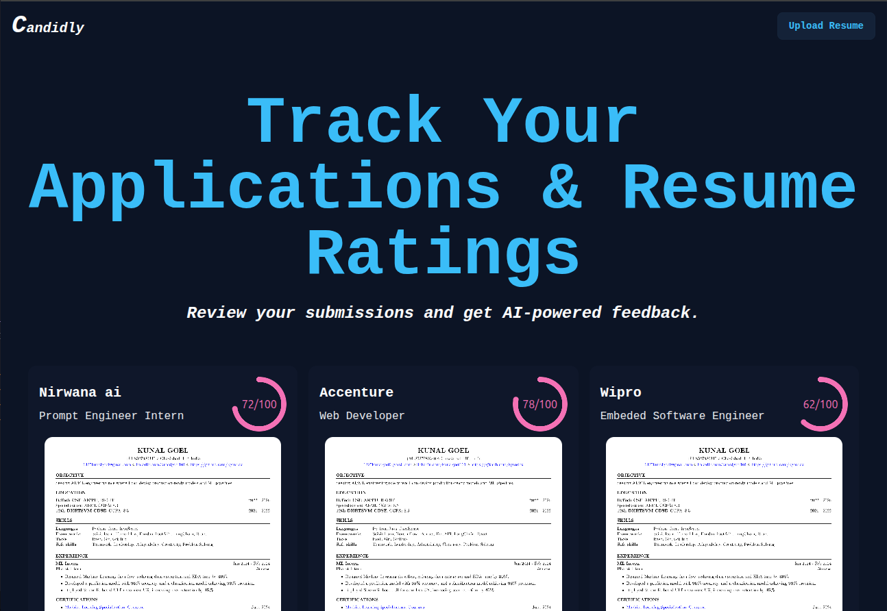

# 📄 Candidly – AI-powered Resume & Application Tracker  

Track your job applications & resume ratings effortlessly!  
Upload your resume, get **AI-powered feedback**, and keep a history of your applications with scores and tips for improvement.  

---

## 🚀 Tech Stack  

| Technology | Description |
|------------|-------------|
|  **React** | Frontend framework for building the UI |
|  **React Router** | For seamless navigation |
|  **TailwindCSS** | Utility-first styling |
|  **DaisyUI** | Tailwind component library for modern UI |
|  **FastAPI** | High-performance backend for handling resume analysis |
|  **LangChain** | AI orchestration for generating feedback & insights |
| 💾 **Puter.js** | Cloud storage integration for managing resumes |
---

## ✨ Features  
- 📤 Upload resumes and get instant feedback.  
- 📊 AI-powered scoring system (ATS compatibility, keywords, readability).  
- 🗂️ Track multiple applications with stored results.  
- 🎨 Modern dark-themed responsive UI (Tailwind + DaisyUI).  
- 🔗 Persistent storage powered by Puter.js.  

---
